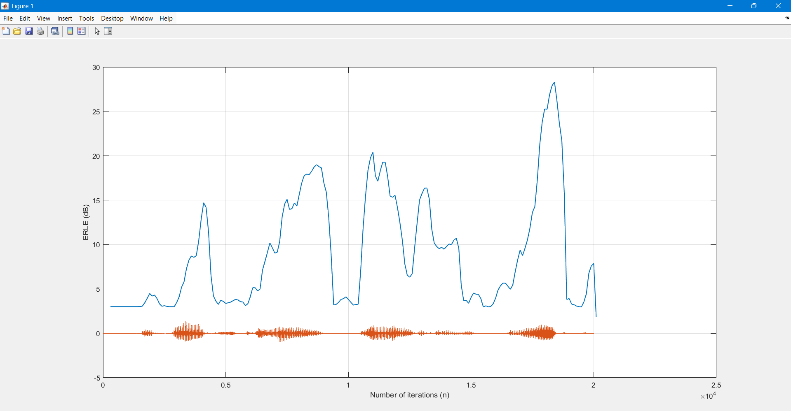
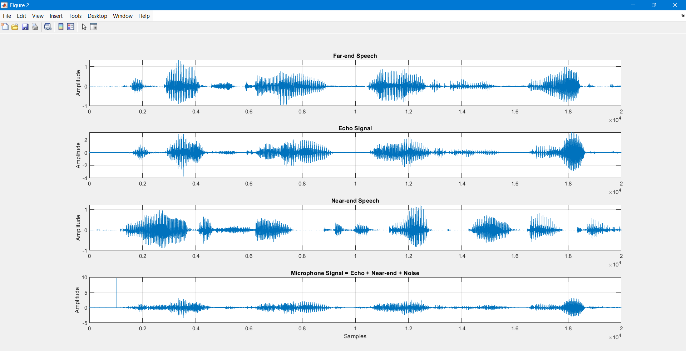
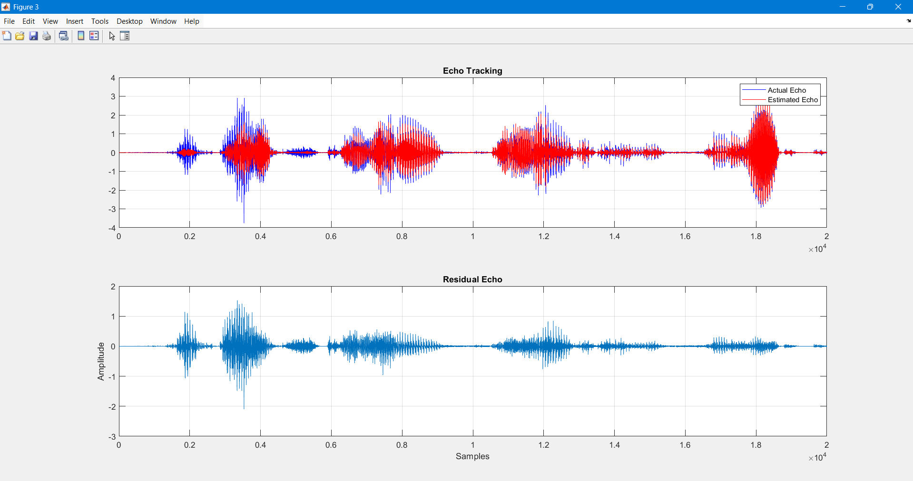
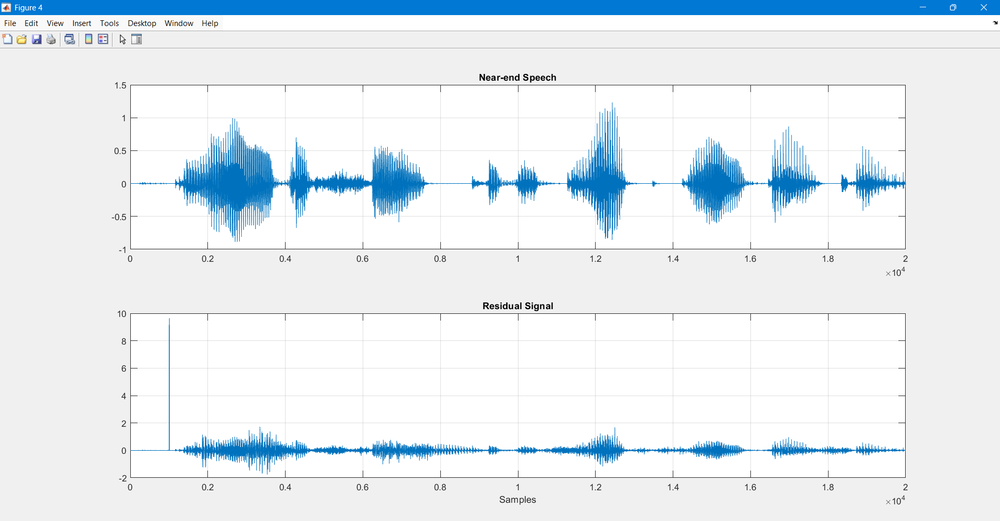
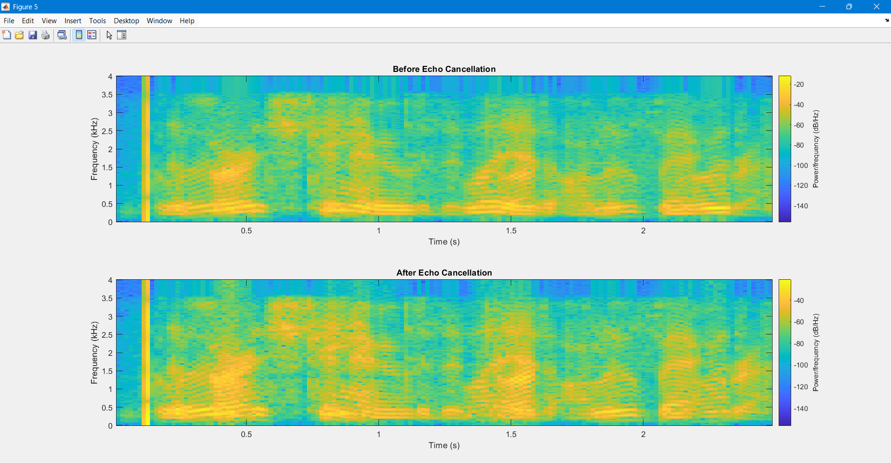

# Adaptive Acoustic Echo Cancellation (AEC) in MATLAB

A sign-error LMS-based acoustic echo canceller built and stress-tested in MATLAB, featuring double-talk detection and outlier rejection for robust performance on real speech signals.

## Overview

This project implements an adaptive filter that estimates and cancels acoustic echo from a microphone signal, using a `tanh`-based sign LMS update rule. It progresses through three stages:

1. **Baseline AEC** (`Case1.m`) — Core adaptive filter validated against a sparse synthetic echo path with additive noise.
2. **Double-Talk Robust AEC** (`case2.m`) — Full far-end/near-end simulation with an adaptive freeze mechanism that halts filter updates during double-talk or impulsive disturbances, preserving near-end speech quality.
3. **Multi-Point Stress Test** (`case2_stress_eval.m`) — Injects multiple impulsive disturbances at different points in the signal to validate filter stability under non-stationary, real-world-like conditions.

## Key Results

- Achieved up to **26 dB ERLE** (Echo Return Loss Enhancement) on sparse echo paths using real speech data.
- Double-talk detection freezes adaptation when `|d(i)| >= T * max(|far_end buffer|)`, preventing filter divergence during simultaneous near-end and far-end speech.
- Verified robustness through ERLE tracking, echo waveform tracking, and before/after spectrogram comparisons.

## Method

- **Adaptive filter**: 256-tap sign-error LMS with `tanh(lambda * e)` nonlinearity for robustness to large errors/outliers.
- **Echo path**: Simulated using two sparse room impulse responses (dominant early + late reflections).
- **Double-talk guard**: Compares instantaneous microphone signal against a scaled running maximum of the far-end buffer; freezes weight updates when the threshold is exceeded.
- **Stress test**: Three impulsive disturbances injected at different time indices to simulate transient interference (e.g., taps, clicks, sudden noise bursts).
- **Evaluation metric**: Short-time ERLE, computed in 100-sample blocks and smoothed with a 3-tap moving-average filter.

## Results

### ERLE Performance (Baseline)
Up to 26 dB of echo suppression tracked over time, overlaid with the input speech waveform.



### Signal Chain Overview
Far-end speech, simulated echo, near-end speech, and the resulting microphone signal (echo + near-end + injected disturbance).



### Echo Tracking & Residual Echo
Actual vs. estimated echo overlay, showing how closely the adaptive filter tracks the true echo path, plus the resulting residual.



### Near-End Preservation
Comparison of the original near-end speech against the residual (error) signal, confirming near-end speech is preserved while echo is suppressed.



### Spectrogram: Before vs. After Cancellation
Time-frequency view of the microphone signal before and after echo cancellation.



## Repository Structure

```
.
├── Case1.m                  # Baseline AEC on sparse echo path
├── case2.m                  # Double-talk robust AEC (far-end + near-end)
├── case2_stress_eval.m      # Multi-point impulsive disturbance stress test
├── S_01_01.wav               # Far-end speech sample
├── S_01_02.wav               # Near-end speech sample
├── erle_curve.png            # Result figures used in this README
├── signals_overview.png
├── echo_tracking.png
├── nearend_residual.png
└── spectrograms.png
```

## Requirements

- MATLAB (tested with base MATLAB + Signal Processing Toolbox for `spectrogram`)
- Audio files `S_01_01.wav` and `S_01_02.wav` in the working directory

## Usage

```matlab
% Baseline AEC
Case1

% Double-talk robust AEC with full visualization suite
case2

% Multi-point stress test
case2_stress_eval
```

Each script generates the ERLE curve plus (for `case2.m` and `case2_stress_eval.m`) signal overview, echo tracking, near-end preservation, and spectrogram figures.
